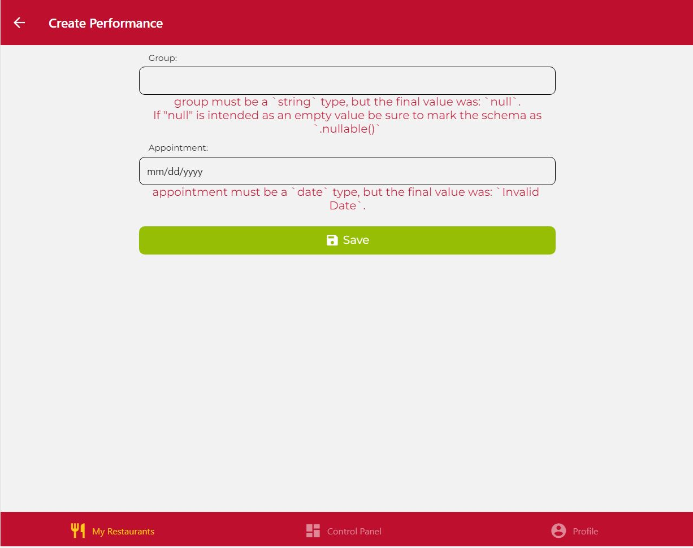

# IISSI-2 IS: Lab exam July 2024. 

## Live performances. Description

After the initial launch of DeliverUS, investors have requested a new feature that allows owners to register live performances in their restaurants in order to advertise their customers.

* On the "MyRestaurants" screen, there will be a new button "Nueva actuación" for each restaurant. By clicking it, the application will move to a form in order to create a new performance. If a restaurant has some performance before a week, it has to appear a badge "¡Próxima actuación!" at the right of its information.

* On the "CreatePerformance" screen there will be a form to register a new performance. Fields include the group name and performance date. Note that there can only be one performance per day. Both fields are required.

* On the "RestaurantDetail" screen, there will be a list of upcoming performances (only before a week, ordered by date, closest first) in the header, below the restaurant logo. 

### Task 1

Make all the necessary changes in the backend project to implement the new requirement. The backend tests expect the route to be: `/performances` and also the "Performances" table includes "id", "group", "appointment" and "restaurantId" fields. 

Remember that you can run the tests with:
```Bash
npm run test:backend
```

Specifically, be aware of those tests in the  `performances.test.js` file.

### Taks 2

Make all the necessary changes in the frontend project to implement the new requirement. You are recommended to use the following styles:

```Bash
badge: {
    textAlign: 'center',
    borderWidth: 2,
    paddingHorizontal: 10,
    borderRadius: 10
  }
```

```Bash
emptyPerformanceList: {
    textAlign: 'center',
    fontSize: 15,
    padding: 20,
    color: 'white'
  }
```

```Bash
containerPerformance: {
    padding: 20,
    backgroundColor: 'rgba(0,0,0,0.5)',
    flexDirection: 'column',
    alignItems: 'center',
    borderRadius: 10
  }
```

## Remarks:

To make easier the development of this exam, you should consider:
* On the "CreatePerformance" frontend screen, note the date format of performance field. By default, it is English format. It is not necessary to change it to Spanish format.

Migration troubles with other "DeliverUS"-based projects:
* This project adds a new table. If **later** you work with other project, first you must delete **all** tables in "DeliverUS" database by using HeidiSQL or another similar tool **before** executing the project migration. This is due to "db:create" and  "db:drop" Sequelize-cli operations are not available for MariaDB.

## Help:

* https://sequelize.org/docs/v6/core-concepts/assocs/#special-methodsmixins-added-to-instances
* https://sequelize.org/docs/v7/querying/operators/
* https://express-validator.github.io/docs/api/validation-chain/#isdate
* https://www.jsdocs.io/package/yup#date

## Screenshots:

Note that **your solution must follow the presentation in these screenshots**:

<div style="display: grid; grid-template-columns: repeat(2, 50%); gap: 20px;">
  
  
  
  
  
</div>

## About supplied base project 

This repository includes the complete backend (folder `DeliverUS-Backend`) and the `owner` frontend (folder `DeliverUS-Frontend-Owner`). It will serve as the basis for the lab exam of the course.

## Environment Setup

### a) Windows

* Open a terminal and run the command `npm run install:all:win`.

### b) Linux/MacOS

* Open a terminal and run the command `npm run install:all:bash`.

## Execution

### Backend

* To **rebuild migrations and seeders**, open a terminal and run the command

    ```Bash
    npm run migrate:backend
    ```

* To **run it**, open a terminal and run the command

    ```Bash
    npm run start:backend
    ```

### Frontend

* To **run the `owner` frontend application**, open a new terminal and run the command

    ```Bash
    npm run start:frontend:owner
    ```

## Debugging

* To **debug the backend**, ensure that there is **NO** running instance, click the `Run and Debug` button on the sidebar, select `Debug Backend` from the dropdown list, and press the *Play* button.

* To **debug the frontend**, ensure that there **IS** a running instance of the frontend you want to debug, click the `Run and Debug` button on the sidebar, select `Debug Frontend` from the dropdown list, and press the *Play* button.

## Testing

* To verify the correct functioning of the backend, you can run the included set of tests. To do this, run the following command:

    ```Bash
    npm run test:backend
    ```
**Warning: Tests cannot be modified.**

## Port Issues

Sometimes, backend or frontend processes, with or without debugging, may get stuck without releasing the used ports, preventing other processes from running. It is recommended to close and restart VSC to close such processes.

## Submission Procedure

1. Delete the **node_modules** folders from backend and frontend and the **.expo** folder from the frontend.
2. Create a ZIP that includes the entire project. **Important: Ensure that the ZIP is not the same as the one you downloaded and includes your solution**
3. Notify the instructor before submitting.
4. When the instructor gives the green light, you can upload the ZIP to the Virtual Teaching platform. Wait for the platform to show a link to the ZIP before clicking the accept button.

If you do not follow carefully these steps, it is possible either your ZIP is not submitted or it contains something but your solution. 
