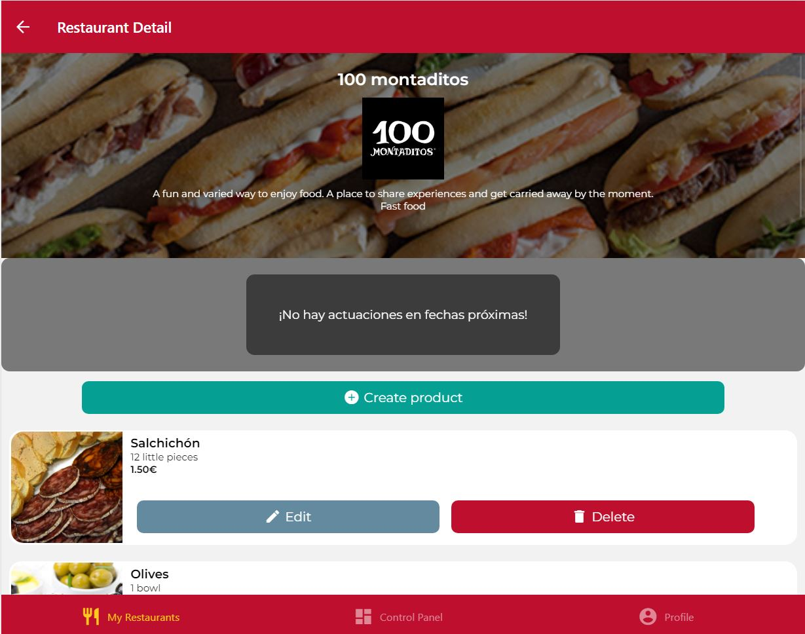

# IISSI-2 IS: Examen de laboratorio Julio 2024. 

## Actuaciones en directo. Enunciado

Una vez se ha puesto en marcha la primera versión de DeliverUS, los inversores han solicitado la inclusión de una nueva funcionalidad que consiste en ofrecer a los propietarios la posibilidad de registrar actuaciones musicales en directo para darle publicidad. 

* En la pantalla "Restaurants" aparecerá un nuevo botón "Nueva actuación" que lleva al formulación de creación de actuación. Si queda menos de una semana para alguna actuación, aparecerá el aviso "¡Próxima actuación!".

* En la pantalla "CreatePerformance" aparece un formulario para registrar una nueva actuación, para la que se pedirá el nombre del grupo y la fecha en la que tendrá lugar. Solo podrá haber una actuación por día. Todos los campos son obligatorios.

* En la pantalla de "RestaurantDetail" aparecerá en su cabecera la información de las próximas actuaciones debajo de la información del restaurante, siempre que quede menos de una semana, ordenadas por proximidad temporal.

### Ejercicio 1

Realice todos los cambios necesarios en el proyecto de backend para implementar el nuevo requisito. Los test de backend esperan que haya una nueva ruta: `/performances` y que los campos de la tabla "Performances" sean "id", "group", "appointment" y "restaurantId". 

Recuerde que puede correr los tests con:
```Bash
npm run test:backend
```
Céntrese en aquellos añadidos al archivo: `performances.test.js`.

### Ejercicio 2

Realice todos los cambios necesarios en el proyecto de frontend para implementar el nuevo requisito. Se sugieren los siguientes estilos:

```Bash
badge: {
    textAlign: 'center',
    borderWidth: 2,
    paddingHorizontal: 10,
    borderRadius: 10
  }
```

```Bash
emptyPerformanceList: {
    textAlign: 'center',
    fontSize: 15,
    padding: 20,
    color: 'white'
  }
```

```Bash
containerPerformance: {
    padding: 20,
    backgroundColor: 'rgba(0,0,0,0.5)',
    flexDirection: 'column',
    alignItems: 'center',
    borderRadius: 10
  }
```

## Aclaraciones:

Para simplificar el desarrollo del examen de laboratorio, tenga en cuenta:
* En el frontend, en la pantalla "CreatePerformance" el campo de fecha sigue el formato inglés por defecto, tal y como se observa en las capturas de pantalla. No es necesario cambiar este formato.

Problemas de migración con otros proyectos de "DeliverUS":
* El proyecto de este examen agrega una tabla nueva. Si **posteriormente al examen** vas a trabajar con otros proyectos de la asignatura, usando HeidiSQL debes borrar todas las tablas de la base de datos "DeliverUS" antes de ejecutar la migración del nuevo proyecto. Esto es debido a que las operaciones "db:create" y "db:drop" de Sequelize-cli no están disponibles para MariaDB.

## Enlaces de ayuda:

* https://sequelize.org/docs/v6/core-concepts/assocs/#special-methodsmixins-added-to-instances
* https://sequelize.org/docs/v7/querying/operators/
* https://express-validator.github.io/docs/api/validation-chain/#isdate
* https://www.jsdocs.io/package/yup#date

## Capturas de pantallas:

Nótese que **la presentación y estilos de estas capturas deben ser fielmente reflejados en tu solución**: 

<div style="display: grid; grid-template-columns: repeat(2, 50%); gap: 20px;">
  
  
  
  
  
</div>

## Proyecto base suministrado

Este repositorio incluye el backend completo (carpeta `DeliverUS-Backend`) y el frontend de `owner` (carpeta `DeliverUS-Frontend-Owner`). Servirá como base para realizar el examen de laboratorio de la asignatura.

## Preparación del entorno

### a) Windows

* Abra un terminal y ejecute el comando `npm run install:all:win`.

### b) Linux/MacOS

* Abra un terminal y ejecute el comando `npm run install:all:bash`.

## Ejecución

### Backend

* Para **rehacer las migraciones y seeders**, abra un terminal y ejecute el comando

    ```Bash
    npm run migrate:backend
    ```

* Para **ejecutarlo**, abra un terminal y ejecute el comando

    ```Bash
    npm run start:backend
    ```

### Frontend

* Para **ejecutar la aplicación frontend de `owner`**, abra un nuevo terminal y ejecute el comando

    ```Bash
    npm run start:frontend:owner
    ```


## Depuración

* Para **depurar el backend**, asegúrese de que **NO** existe una instancia en ejecución, pulse en el botón `Run and Debug` de la barra lateral, seleccione `Debug Backend` en la lista desplegable, y pulse el botón de *Play*.

* Para **depurar el frontend**, asegúrese de que **EXISTE** una instancia en ejecución del frontend que desee depurar, pulse en el botón `Run and Debug` de la barra lateral, seleccione `Debug Frontend` en la lista desplegable, y pulse el botón de *Play*.

## Test

* Para comprobar el correcto funcionamiento de backend puede ejecutar el conjunto de tests incluido a tal efecto. Para ello ejecute el siguiente comando:

    ```Bash
    npm run test:backend
    ```
**Advertencia: Los tests no pueden ser modificados.**

## Problemas con los puertos

En ocasiones, los procesos de backend o frontend, con o sin depuración, pueden quedarse bloqueados sin liberar los puertos utilizados, impidiendo que puedan ejecutarse otros procesos. Se recomienda cerrar y volver a iniciar VSC para cerrar dichos procesos.


## Procedimiento de entrega

1. Borrar las carpetas **node_modules** de backend y frontend y **.expo** del frontend.
1. Crear un ZIP que incluya todo el proyecto. **Importante: Comprueba que el ZIP no es el mismo que te has descargado e incluye tu solución**
1. Avisa al profesor antes de entregar.
1. Cuando el profesor te dé el visto bueno, puedes subir el ZIP a la plataforma de Enseñanza Virtual. **Es muy importante esperar a que la plataforma te muestre un enlace al ZIP antes de pulsar el botón de enviar**. Se recomienda descargar ese ZIP para comprobar lo que se ha subido. Un vez realizada la comprobación, puedes enviar el examen.
  
Si no se siguen estos pasos de manera escrupulosa, cabe la posibilidad de que no se entregue nada o que el ZIP contenga cualquier cosa. 
